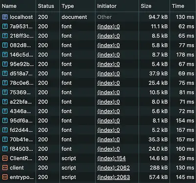

While redesigning my personal site (which I’ll write about soon!), I decided it was time to customize the font a bit changing it to `Inter`. Since the site is built with Astro, I looked into their recommended approaches for font customization.

That’s when I learned about their new experimental Fonts API. It looked promising — a type-safe, optimized solution built right in.

So I gave it a shot by adding something like this to my `astro.config.ts` file:

```ts
import { defineConfig, fontProviders } from "astro/config";

export default defineConfig({
  experimental: {
    fonts: [{
      provider: fontProviders.google(),
      name: "Inter",
      cssVariable: "--font-inter"
    }]
  }
});
```

But then I opened the Network tab in my browser and saw this:



14 font files on initial load!

Digging into the resulting HTML `<head>`, I found that:

1. The API was generating 14 @font-face rules, one for each variation.

2. The API also has some fallback optimization, in my case the fallback that it picked is Arial.

3. By default, Astro seems pretty generous with what it includes — pulling in many subsets (`cyrillic-ext`, `cyrillic`, `greek-ext`, and more).

To fix this, I tweaked the configuration until I landed on something more efficient:

```ts
experimental: {
		fonts: [
			{
				provider: fontProviders.google(),
				name: 'Inter',
				cssVariable: '--font-inter',
				styles: ['normal'],
				weights: ['400 500'],
				subsets: ['latin']
			}
		]
	}
```

Here’s what made the biggest difference:

- Only load the styles I actually use: I don’t use italic or oblique, so I excluded those.
- Limit to the needed weights: I use just 400 and 500. Specifying them as a range (`['400 500']`) instead of an array (`['400', '500']`) ensures only one font file is downloaded.
- Subset to only latin characters: No need to load glyphs I don’t use.

With this setup, I’m now down to just one font file — and the swap from fallback to custom font is barely noticeable.
